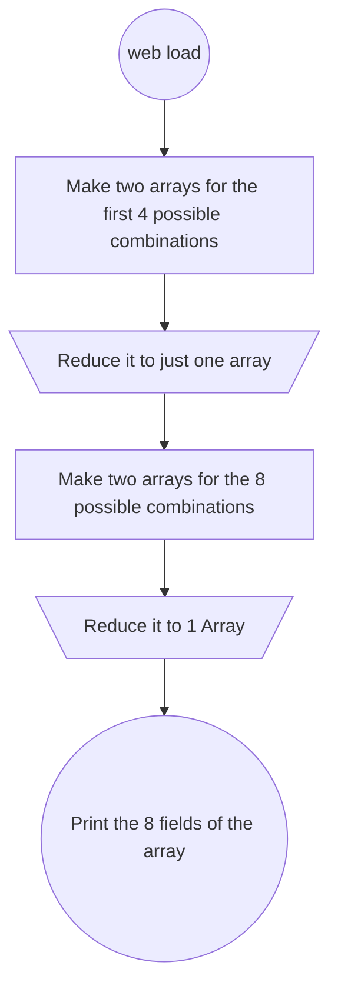

```mermaid


flowchart TD;
    A((web load))
    B[Make two arrays for the first 4 possible combinations]
    C[\Reduce it to just one array/]
    D[Make two arrays for the 8 possible combinations]
    E[\Reduce it to 1 Array/]    
    F((Print the 8 fields of the array))

A --> B --> C --> D --> E --> F

```
