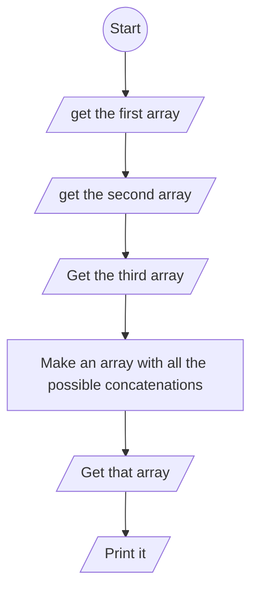

```mermaid


flowchart TD;
    A((Start))
    B[/get the first array/]
    C[/get the second array/]
    D[/Get the third array/]
    E[Make an array with all the possible concatenations]
    F[/Get that array/]
    G[/Print it/]

A --> B --> C --> D --> E --> F --> G

```
